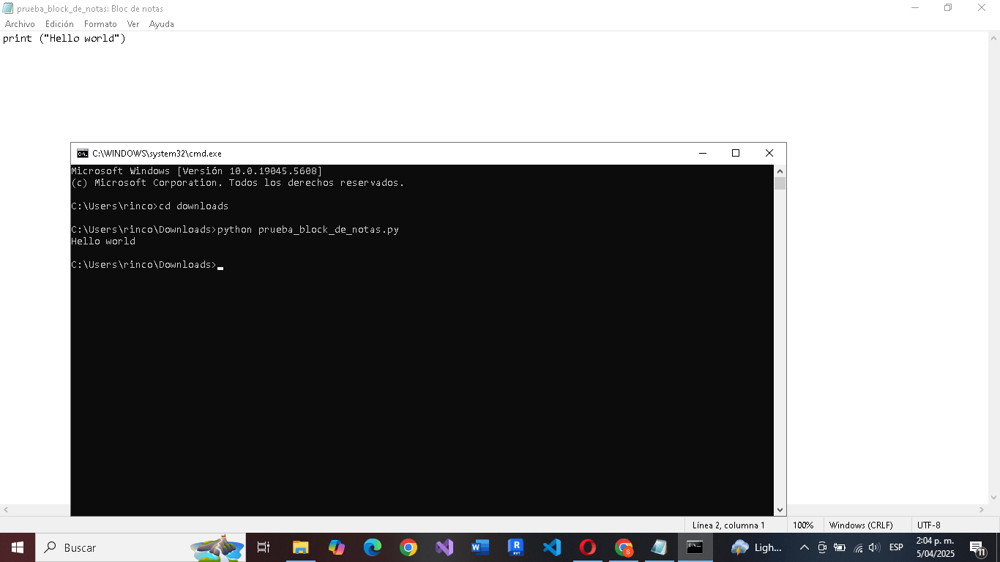
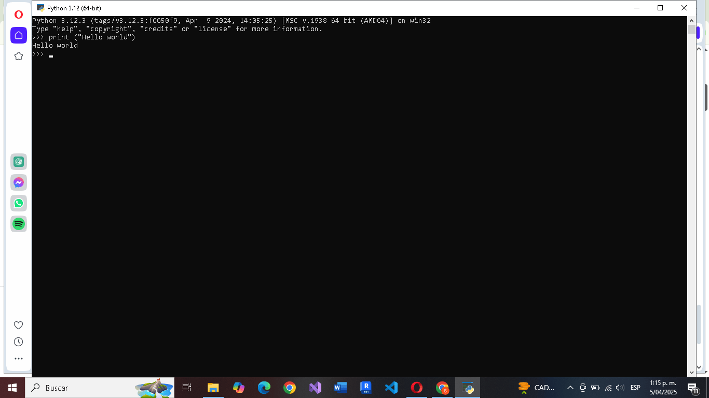
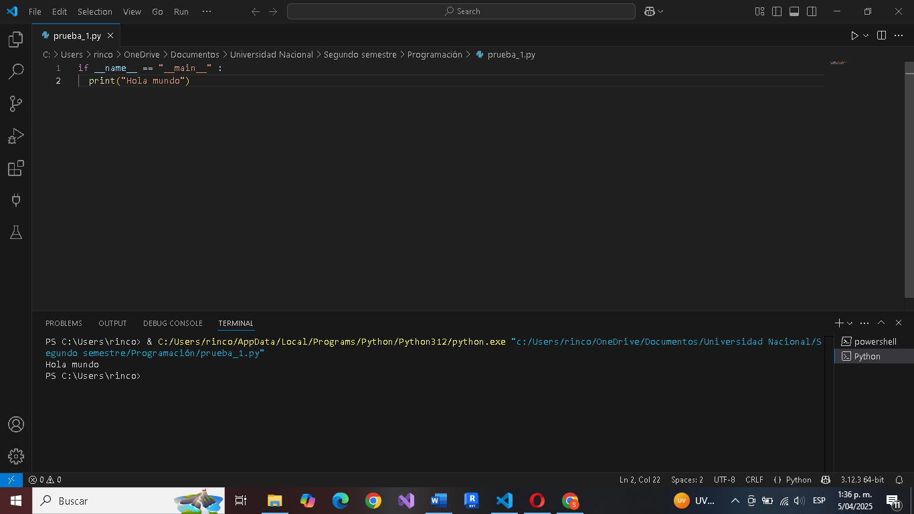

# Repositorio reto #2 (Mi primer hello world)

## Nombre : Brayan Santiago Rincón Rodríguez.

Código usado:
if __name__ == "__main__" :
  print("Hola mundo")

 Este repositorio nos mostrará tres herramientas fundamentales donde podremos ejecutar el famoso "Hello World" en el lenguaje de programación (python).

1. En el block de notas:
- Creé un archivo en block de notas, en donde pegué el código y lo guardé como un archivo .py en una carpeta fácil de encontrar. Posteriormente, abrí el terminal en la carpeta dónde estaba guardado. Ejectuté: python Prueba_1.py

- Se obtuvieron los siguientes resultados: 

2. En el intérprete:
- Para esta prueba, abrí el terminal y escribí "python", luego, pegué el código y de esta manera me permitió ejecutar el código.

- Se obtuvieron los siguientes resultados: 

3. En VS Code: 

- Abrí el archivo hola_mundo.py directamente en Visual Studio Code. Desde ahí, utilicé la terminal para ejecutar, esto se puede realizar mediante el atajo control+j y escribiendo en la terminal python prueba_1.py o directamente con el botón de RUN ubicado en la esquina superior derecha del editor.

- Se obtuvieron los siguientes resultados:    

### Autor
Brayan Santiago Rincón Rodríguez

### Curso
Programación de computadores